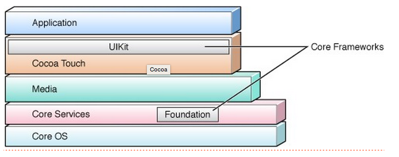

#Foundation

## 概述

```
int result = ^(int a){return a*a;}(5);  
NSLog(@"%d", result);
```

## 常用结构体
```
CGPoint
CGSize
CGRect
CGVector
CGPointZero
```
## 基础对象
```
#import <Foundation/Foundation.h>

//1.NSDate
void DataTest(){
    NSDate *date1=[NSDate date];
    NSDate *date2=[NSDate dateWithTimeIntervalSinceNow:100];//在当前日期的基础上加上100秒，注意在ObjC中多数时间单位都是秒

    NSDate *date3=[NSDate distantFuture];//随机获取一个将来的日期

    NSTimeInterval time=[date2 timeIntervalSinceDate:date1];//日期之差,返回单位为秒

    NSDate *date5=[date1 earlierDate:date3];//返回比较早的日期

    //日期格式化
    NSDateFormatter *formater1=[[NSDateFormatter alloc]init];
    formater1.dateFormat=@"yy-MM-dd HH:mm:ss";
    NSString *datestr1=[formater1 stringFromDate:date1];
    NSDate *date6=[formater1 dateFromString:@"14-02-14 11:07:16"];
}

//2.NSString
void NSStringTest(){
    NSString *str2=@"OC string";
    NSString *str5=[[NSString alloc] initWithFormat:@"age is %i,name is %.2f",19,1.72f];
    NSString *str6=[[NSString alloc] initWithUTF8String:"C string"];
    [str6 uppercaseString];
    [str6 lowercaseString];
    [str6 capitalizedString];

    NSMutableString *str1= [[NSMutableString alloc] initWithCapacity:10];
    [str1 setString:@"hello"];
    [str1 appendString:@",world!"];
}

//3.NSArray
void NSArrayTest(){
    NSArray *array1=[NSArray arrayWithObjects:@"abc",obj,@"cde",@"opq",@25, nil];
    NSMutableArray *array2=[NSMutableArray arrayWithObjects:person1,person2,person3, nil];
    //方法1
    for(int i=0,len=array1.count;i<len;++i){
        NSLog(@"method1:index %i is %@",i,[array1 objectAtIndex:i]);
    }

    //方法2
    for(id obj in array1){
        NSLog(@"method2:index %zi is %@",[array1 indexOfObject:obj],obj);
    }
}

//4.NSDictionary
void NSDictionaryTest(){
    NSDictionary *dic1=[NSDictionary dictionaryWithObjectsAndKeys:
                        @"1",@"a",
                        @"2",@"b",
                        @"3",@"c",
                        @"2",@"d",
                        nil];

    for (id key in dic1) {
        NSLog(@"%@=%@",key,[dic1 objectForKey:key]);
}
```
## 反射
void Test(){

    Person *person1=[Person new];
    [person1 isKindOfClass:[NSObject class]];
    [person1 isMemberOfClass:[Person class]];
    [person1 conformsToProtocol:@protocol(NSCopying)]);
    [person1 respondsToSelector:@selector(showMessage:)]);
    [person1 showMessage:@"Hello,world!"];
    [person1 performSelector:@selector(showMessage:) withObject:@"Hello,world!"];


    //动态生成一个类
    NSString *className=@"Person";
    Class myClass=NSClassFromString(className);//根据类名生成类
    Person *person2=[[myClass alloc]init]; //实例化
    person2.name=@"Kaoru";
    NSLog(@"%@",person2);//结果：name=Kaoru

    NSLog(@"%@,%@",NSStringFromClass(myClass),NSStringFromClass([Person class]));

    //调用方法
    NSString *methodName=@"showMessage:";
    SEL mySelector=NSSelectorFromString(methodName);
    Person *person3=[[myClass alloc]init];
    person3.name=@"Rosa";
    [person3 performSelector:mySelector withObject:@"Hello,world!"]; 

    //方法转化为字符串
    NSLog(@"%@",NSStringFromSelector(mySelector)); //结果：showMessage:
}
